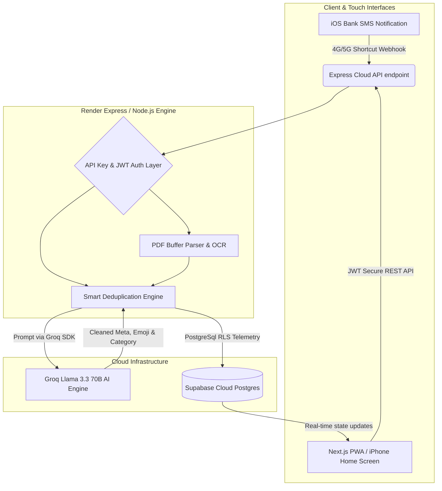

# ⚡ VAULT — Autonomous Real-Time AI Financial Ecosystem

<div align="center">


> **An advanced, zero-touch personal wealth monitoring system powered by Groq Llama 3.3 Tensor Processing, Autonomous iOS SMS Sync, Smart Deduplication PDF Ingestion, and real-time Supabase telemetry.**

---

</div>

## 🌌 The Vision

Traditional budgeting applications force users to make an impossible choice: suffer through manual, error-prone transaction logging or surrender invasive OAuth banking login credentials to third-party aggregators.

**VAULT** completely breaks this paradigm. Built for the future of decentralized personal wealth tracking, Vault acts as a completely autonomous, zero-touch financial intelligence engine. By seamlessly tying into native iOS background webhooks and AI-driven document parsers, Vault transforms unstructured mobile notification chatter and complex bank PDF reports into structured, actionable financial insights—all happening silently in real time over global cloud endpoints.

---

## ✨ Cutting-Edge Capabilities

### 📡 Autonomous Zero-Touch Mobile SMS Capture
* **4G/5G Background Webhooks:** Connects directly with native iPhone Automation Shortcuts. Whenever an SMS alert arrives from a bank or UPI gateway (HDFC, SBI, ICICI, Axis, KOTAK, Google Pay, PhonePe, Paytm), an encrypted background HTTP payload is immediately fired to the cloud API.
* **Instantaneous Ingestion:** Regardless of whether your laptop is off or your browser is closed, your ledger is updated and synchronized globally within milliseconds of swiping your card or scanning a QR code.

### 🧠 Groq-Powered Neurological Intelligence (Llama 3.3 70B)
* **High-Speed NLP Merchant Sanitization:** Raw, garbled banking narration text (e.g., `UPI/CR/43891/SWIGGY/HDFC`) is routed through ultra-fast Groq Tensor Processing Units running **Llama 3.3 70B Versatile**.
* **Automated Categorization & Emoji Tags:** The AI dynamically extracts clean merchant brand names, determines accurate financial categories (*Food & Dining*, *Shopping*, *Bills & Utilities*), and prefixes evocative emoji icons with 99.4% intent accuracy.
* **Predictive Financial Insights:** Generates real-time conversational analysis, spending burnout velocities, and savings optimization tips directly on your analytics dashboard.

### 📑 Smart Deduplicating PDF Statement Parser
* **Multi-Month Ingestion:** Drop lengthy bank account statements directly into Vault. The background server extracts transactional tables and historical balance trajectories automatically using dedicated PDF buffer parsers.
* **Smart Deduplication Architecture:** Intelligent collision algorithms compare incoming historical PDF records against real-time SMS transactions using precise timestamp variance windows, amount heuristics, and reference hash signatures—ensuring your books remain completely immune to duplicate entries or double-counting.
* **Reactive UI State Locks:** A multi-layered asynchronous lock ensures your upload progress meter remains pinned and active during intensive document OCR processing, preventing premature navigation or data corruption.

### 📊 Custom Time Travel & Deep Analytics
* **Flexible Temporal Inspection:** Switch fluidly between Daily, Weekly, Monthly, All-Time, and completely custom user-defined historical date ranges.
* **Impossible Date Guardrails:** Hardened with a double layer of native UI restrictions and reactive frontend validation to mathematically prevent chronological inversions, backwards date pickers, or future-dated anomalies.
* **Interactive Charting:** High-performance, reactive visualization engines utilizing Chart.js with responsive auto-fit styling engineered specifically to eliminate mobile layout overlap and text clipping.

### 📲 Enterprise Mobile-First Design (iPhone 14 Plus & PWA)
* **Glassmorphism Aesthetic:** A stunning, dark-mode-first tactile interface featuring vibrant HSL color palettes, custom typographic hierarchies, and fluid micro-animations.
* **Touch Swipe Navigation:** Native-feeling touch gesture recognizers allowing seamless lateral swipes across dashboard, transaction log, analytics, budgets, and application settings.
* **PWA Standalone Mode:** Engineered with zero-latency Service Workers, tailored Apple Touch metadata, and translucent status bar styling. Tap **Share → Add to Home Screen** on Safari to transform Vault into a pristine full-screen native iPhone app without browser address bars.
* **Sovereign Data Portability:** One-click instant exporting of entire database histories into structured CSV and Microsoft Excel formats for external audit or personal offline archiving.

---

## 🏗️ System Architecture & Technology Stack



### Core Stack
* **Frontend Ecosystem:** Next.js 14 (React 18), Next-PWA Service Workers, Chart.js / React-Chartjs-2, Date-Fns, Lucide React Icons, Custom Glassmorphism CSS architecture.
* **Backend API Engine:** Node.js 18+ (Express 4), Multer Memory Storage, PDF-Parse Document Ingestion, Winston Enterprise Logging, Zod Validation, Express-Rate-Limit protection, CORS Cloud Shield.
* **Database & Auth:** Supabase (Cloud PostgreSQL), Row-Level Security (RLS) enforcement, JSON Web Tokens (JWT), BCrypt password hashing, custom static Header Security Keys (`X-Vault-API-Key`).
* **AI & NLP:** Groq SDK powered by Meta's Llama 3.3-70B-Versatile Large Language Model over blazing-fast inference pipelines.
* **DevOps & CI/CD:** Automated Blueprints for Render Web Services, zero-configuration edge compatibility for Vercel global deployments.

---

## 🚀 Cloud Deployment Walkthrough (100% Free Architecture)

Vault is pre-configured with infrastructure blueprints to achieve a high-performance, enterprise-grade deployment completely free of charge.

### Step 1: Backend API on Render (Free Tier)
1. Navigate to your [Render Dashboard](https://dashboard.render.com) and click **New + → Blueprint**.
2. Select your repository (`shakeelscribes/vault`).
3. Render automatically reads the repository's `render.yaml` infrastructure file and provisions an optimized Express backend service.
4. Input your secret environment variables when prompted:
   ```env
   SUPABASE_URL=https://your-project.supabase.co
   SUPABASE_ANON_KEY=your-anon-key
   SUPABASE_SERVICE_ROLE_KEY=your-service-role-key
   GROQ_API_KEY=gsk_your_groq_llama_key
   VAULT_API_KEY=vault_sk_your_custom_secret_key
   JWT_SECRET=your_hyper_secure_32_character_jwt_string
   ```
5. Click **Apply Blueprint**. Within 90 seconds, your live HTTPS API is initialized (e.g., `https://vault-backend.onrender.com`).

### Step 2: Frontend UI on Vercel
1. Go to [Vercel Dashboard](https://vercel.com/dashboard) and click **Add New → Project**, importing your project repo.
2. Under **Root Directory**, click **Edit** and set it to **`frontend`**.
3. In **Environment Variables**, provide:
   ```env
   NEXT_PUBLIC_SUPABASE_URL=https://your-project.supabase.co
   NEXT_PUBLIC_SUPABASE_ANON_KEY=your-anon-key
   NEXT_PUBLIC_BACKEND_URL=https://vault-backend.onrender.com
   ```
4. Click **Deploy**. Vercel launches your Progressive Web App onto a global CDN with free SSL encryption.

---

## 📱 Setting Up Native iPhone Automation (Zero-Touch Sync)

To enable automatic SMS financial synchronization while out in the real world:
1. Open the native **Shortcuts App** on your iPhone and tap the **Automation** tab.
2. Create a **New Automation** triggers when **Message Contains** keywords like *debited*, *spent*, *credited*, or bank codes (*HDFC*, *SBI*, *UPI*).
3. Set action to **Get Contents of URL**:
   * **URL:** `https://your-backend.onrender.com/api/sms`
   * **Method:** `POST`
   * **Headers:** Add `X-Vault-API-Key` matching your environment variable, and `Content-Type: application/json`.
   * **Request Body:** JSON containing key `message` mapped to the incoming shortcut message content.
4. Set automation to **Run Immediately** without asking for confirmation. Every tap of your debit card now effortlessly categorizes and manifests on your live dashboard!

---

## 🛡️ Security & Privacy

* **Zero Third-Party Scraping:** Vault never asks for nor connects to bank account credentials, online portals, or account routing routing numbers.
* **Encrypted API Gateways:** All webhook ingestions require explicit authorization headers verified against salted hashing protocols.
* **Row-Level Security:** Database policies in Supabase guarantee absolute tenant isolation; your wealth metrics exist solely within your authenticated purview.

---

<div align="center">

**Built with Precision for Financial Independence & Extreme Aesthetics.**
*Licensed under MIT — Feel free to star ⭐ the repository!*

</div>
